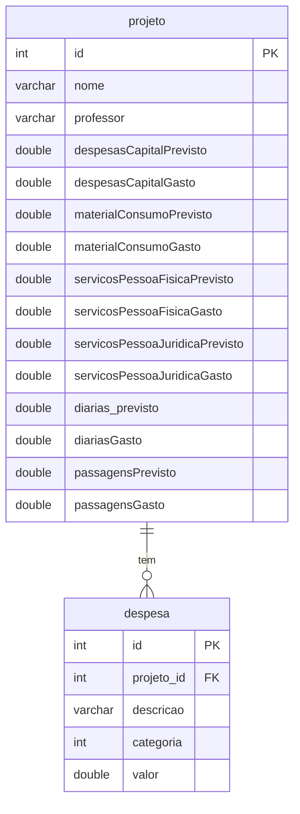
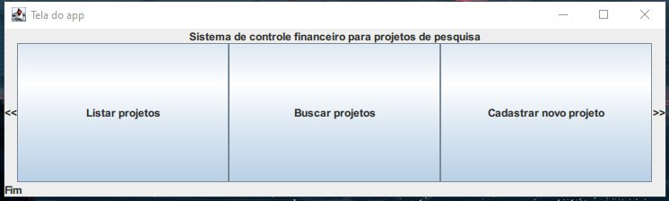
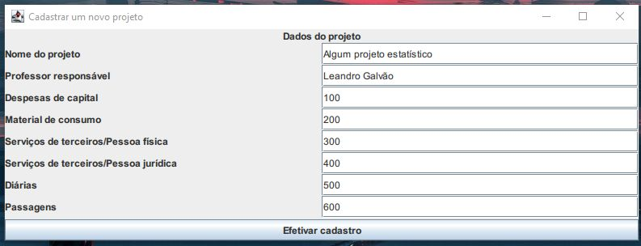
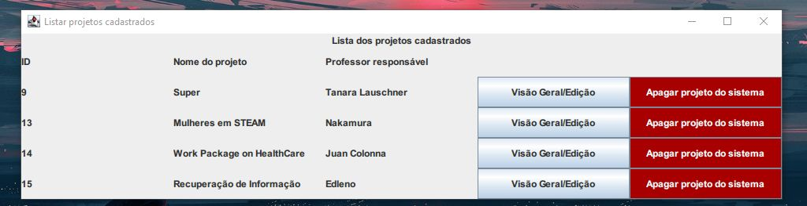
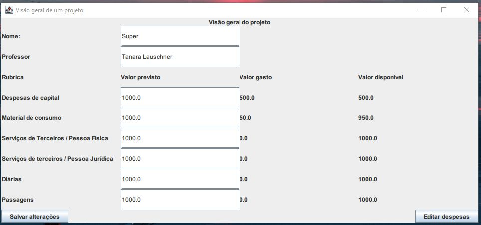
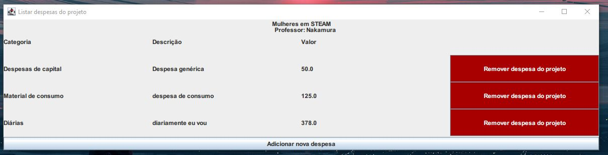
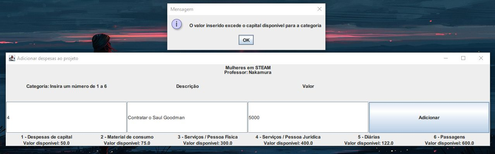
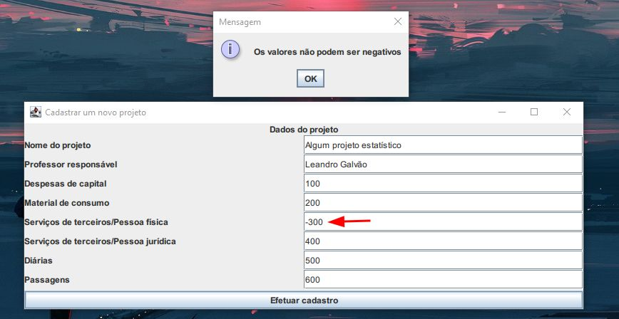
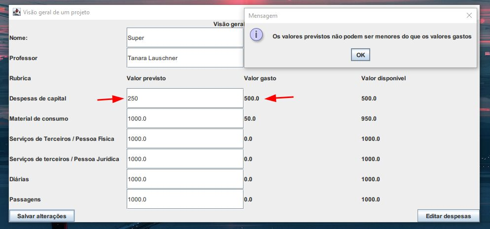

# Financial control system for research projects

## About

This is a financial control system for research projects. It was developed using Java and MySQL as an assignment for the Object-Oriented Programming course.

## Database design

## Screenshots

### Main screen

### Register a new project

### List of projects

### Project overview

### List of expenses

## Practicing exception handling

### Error adding a new expense

### Error adding a new project

### Error updating project information

